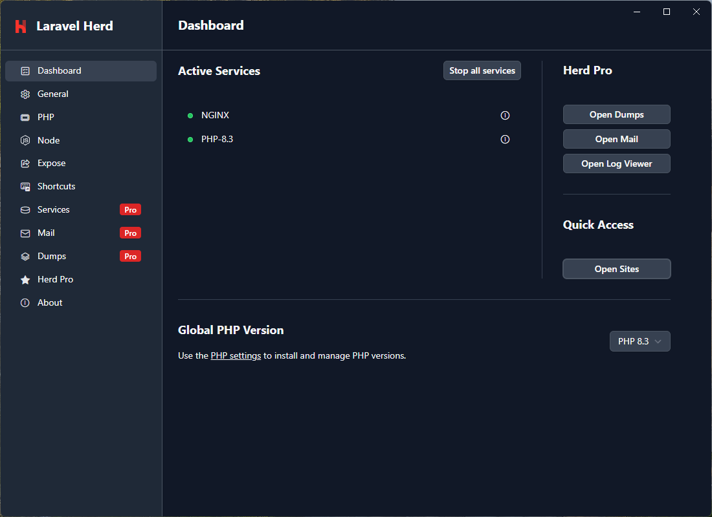
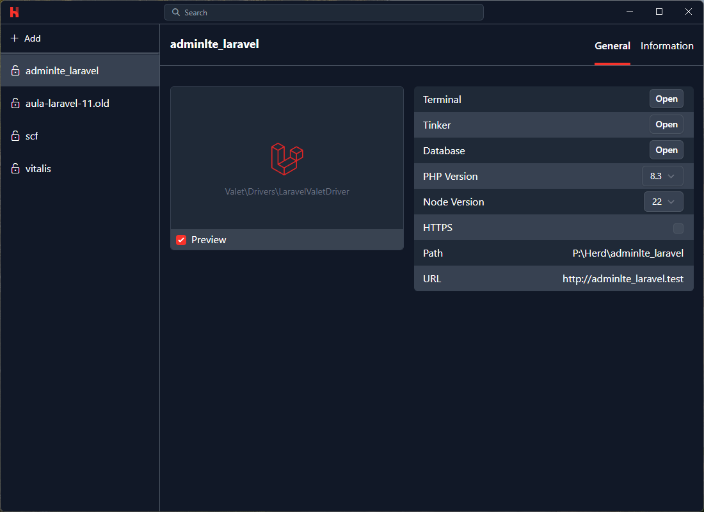
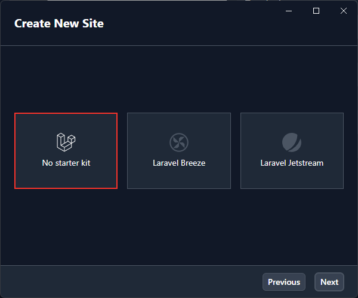
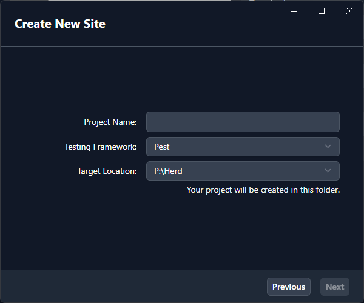
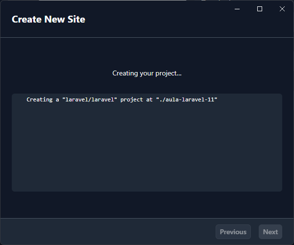
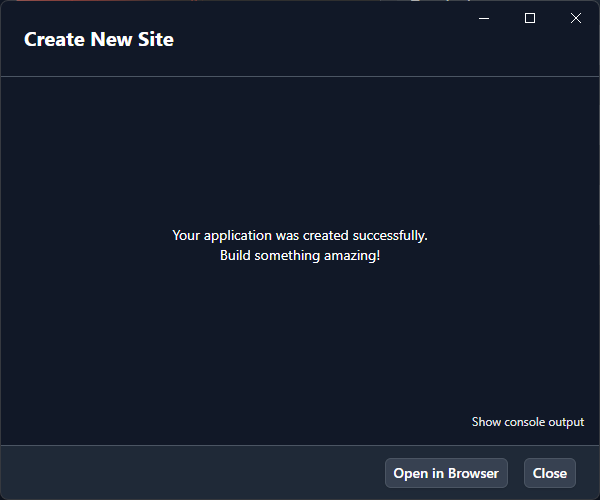
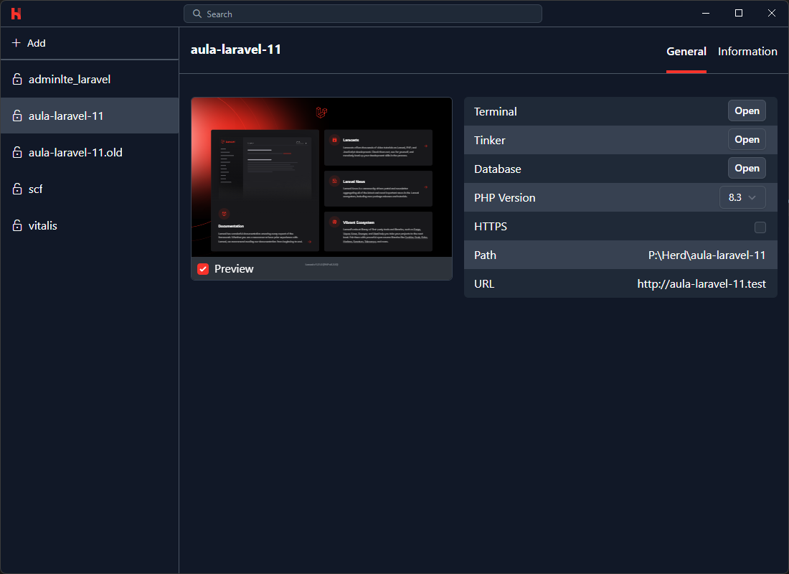
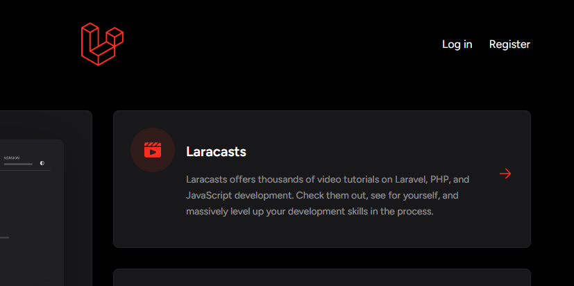
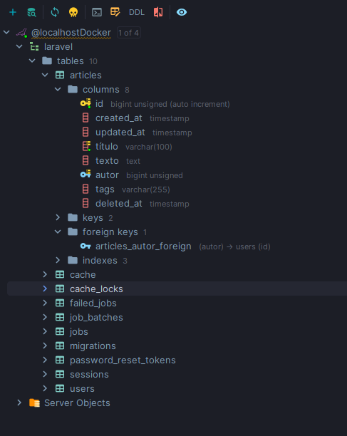

<p align="center">
 
</p>
<h2 align="center">Laravel para iniciantes</h2>

<div align="center">

[](#)
[](#)

</div>

---

<p align="center"> Este tutorial é perfeito para você começar! Vamos guiá-lo passo a passo na criação de um projeto do zero. Utilizaremos o <a href='https://herd.Laravel.com/windows'>Laravel Breeze</a> como pacote inicial e implementaremos uma gestão completa de usuários no Laravel 11.
    <br> 
</p>

> [!IMPORTANT]
> Para elaboração deste tutorial foi utilizado a documentação oficial do Laravel e como inspiração o curso de Laravel 11 da Especializa TI, que pode ser acessado pelo link: [Playlist Laravel  11 - Especializa TI](https://www.youtube.com/playlist?list=PLVSNL1PHDWvThyUgAgJoulpg5kB7GpYqS).

## 📝 Conteúdo

- [Entendendo o Laravel](#Laravel)
- [Configurando o Ambiente](#ambiente)
- [Laravel Breeze](#breeze)
- [Banco de Dados e Migrations](#migrations)
- [Model, View e Controller (MVC)](#mvc)
- [Rotas](#routes)
- [Construindo o CRUD de usuários](#crud)
- [Validação](#validacao)
- [Blade Template](#blade)
- [Middlewares](#middlewares)
- [Autorizações - ACL](#acl)

## 🧐 Entendendo o Laravel <a name = "Laravel"></a>

[Laravel](https://Laravel.com/) é um framework PHP que facilita o desenvolvimento web com uma sintaxe elegante e expressiva. Ele oferece recursos como roteamento simples, injeção de dependência, migrações de banco de dados, e o Eloquent ORM para interagir com bancos de dados de forma intuitiva. Além disso, possui ferramentas integradas para autenticação, autorização, filas de trabalho e eventos em tempo real. O ecossistema Laravel inclui o Laravel Breeze para autenticação básica, Laravel Forge para gerenciamento de servidores, e Laravel Vapor para implantação serverless. Com uma [documentação](https://Laravel.com/docs/11.x) extensa e uma comunidade ativa, Laravel é uma excelente escolha para desenvolvedores que buscam produtividade e flexibilidade.

> [!IMPORTANT] 
> O Laravel é famoso por sua [documentação](https://Laravel.com/docs/11.x), ela é bem completa e te prepara para todo o processo de desenvolvimento. Todo o curso é baseado na documentação oficial do Laravel, os links de cada parte será deixado para conferências e acompanhamento.

Há três ferramentas que podem ser destacadas no Laravel: Eloquente Model, Artisan e Migrations.

### [Eloquente Model](https://Laravel.com/docs/11.x/eloquent)
O Eloquent é o ORM (Object-Relational Mapper) do Laravel, que facilita a interação com bancos de dados. Cada tabela do banco de dados tem um modelo correspondente que permite realizar operações como inserção, atualização, exclusão e consulta de registros de forma intuitiva. O Eloquent utiliza uma sintaxe expressiva, tornando o código mais legível e fácil de manter. Por exemplo, o código abaixo salva um registro no banco de dados:

```php
$article = Article::create(['title' => 'Traveling to Europe']);
```
### [Artisan Console](https://Laravel.com/docs/11.x/artisan)
O Artisan é a interface de linha de comando do Laravel, que oferece diversos comandos úteis para agilizar o desenvolvimento. Com o Artisan, você pode criar modelos, controladores, migrações, entre outros. Ele também permite executar tarefas como limpar o cache, rodar testes e agendar comandos. Um exemplo de comando Artisan para criar um modelo e logo após como iniciar um servidor local diretamente pelo artisan:
```bash
php artisan make:model NomeDoModelo

php artisan serve
```

### [Migrations](https://Laravel.com/docs/11.x/migrations)
As migrations no Laravel funcionam como um controle de versão para o banco de dados, permitindo que você defina e compartilhe a estrutura do banco de dados da aplicação. Elas são especialmente úteis para equipes de desenvolvimento, pois garantem que todos estejam usando a mesma versão do esquema do banco de dados. Abaixo um exemplo de uma tabela criada utilizando migrations:
```php
Schema::create('users', function (Blueprint $table) {
    $table->id();
    $table->string('name');
    $table->string('email');
    $table->timestamps();
});
```


## 🔧 Configurando o Ambiente<a name = "ambiente"></a>

> [!TIP] 
> Será ensinado como configurar o ambiente utilizando o [Laravel Herd](https://herd.Laravel.com/) no Windowns. Há diversas formas de instalar e configurar o Laravel, e podem ser vistas na [documentação](https://Laravel.com/docs/11.x/installation). Algumas delas são descritas abaixo:
<br/><br/> [Utilize Docker personalizado](https://github.com/especializati/setup-Docker-Laravel)
<br/> O pessoal da <i>EspecializaTI<i> tem um setup complet de Docker para o lavarel, é só seguir as dicas e configurar o seu ambiente utilizando Docker.
<br/><br/>[Utilize Laravel Sail](https://Laravel.com/docs/11.x/sail)
<br/> O Laravel Sail é o ambiente padrão e oficial para desenvolver Laravel utilizando Docker, pode ser seguido o passo a passo da documentação.
<br/><br/>[PHP Composer](https://Laravel.com/docs/11.x/installation#creating-a-Laravel-project)
<br/>Método mais básico, utliza o compose para baixar e instalar o Laravel na sua máquina, e pode ser criado um server local utlizando a prória ferramenta Artisand do Laravel.
<br/><br/> [Utilize o Laravel Herd](https://herd.Laravel.com/windows)
<br/> O Heard é um abiente próprio do Laravel e tem como objetivo padronizar o ambiente de desenvolvimento. É de fácil instalação e configuração.

<br/>

### Laravel Herd no Windows, utilizando Docker para persistir os dados

Para download do Herd, prossiga até o site https://herd.Laravel.com/windows e faça o download do arquivo. <br/>
A instalação é padrão como qualquer outro aplicativo, e você não deverá ter muitos problemas.

> [!CAUTION] 
> No Windows, antes de instalar o Herd, tenha certeza de que não possui o PHP, Node e Composer instalados no seu computador. O Herd instala estas ferramentas automaticamente e configuram as variáveis de ambiente corretamente, portanto, caso já tenha instalado, poderá haver um conflito de versões.

#### Criação de projetos no Herd
Após a instalação do Laravel Herd, ele irá abrir na tela inicial, como a figura abaixo. Nela podemos ver os serviços instalados e iniciados, e também podemos começar as configurações dos sites que o Herd gerencia, clicando na opção ***Open Sites***.<br/>

<br/><br/>
Na tela de *Sites*, imagem abaixo, podemos ver todos os sites atualmente gerenciados pelo Herd a esquerda e algumas opções de gerenciamento a direita. Para a criação de novos sites, devemos clicar no botão ***+Add***.
<br/>

<br/>

#### Criando sites no Herd
Para criar sites, é necessário selecionar se é um projeto novo ou existente:
<br/>

<br/><br/>
Depois selecionar se irá utilizar alguns dos kits prontos do Laravel, ***Para este tutorial iremos inicial sem nenhum starter kit***:
<br/>

<br/><br/>
Digite o nome do projeto:
<br/>

<br/><br/>
Aguarde a criação do projeto:
<br/>

<br/><br/>
Após a finalização irá aparecer uma tela de sucesso:
<br/>

<br/><br/>
E agora podemos ver e gerenciar o site pelo Herd:
<br/>

<br/><br/>
Se abrirmos a URL especificada na tela anterior, teremos acesso ao nosso site.
<br/>


#### Criando um servidor local do MySQL com Docker
Para a persistência de dados, iremos utilizar um servidor MySQL utilizando Docker. Para isso, disponibilizei neste projeto um [arquivo composer do Docker](docker-compose.yml), com uma configuração simples para a criação de um container MySQL e Adminer, para a gestão do banco de dados.
> [!NOTE]
> O MySQL foi configurado para a porta 3310 (com intuito de evitar conflitos com outras instalações). O usuário padrão é *root* e a senha é *123*. Para acessar o adminer utilize a porta [8082](http://localhost:8082/).

Para criar o container utilize o comando:
```bash
Docker compose up -d
```
Para configurar o acesso do Laravel ao banco de dados, devemos atualizar as informações no arquivo [.env](.env):
```env
DB_CONNECTION=mysql
DB_HOST=127.0.0.1
DB_PORT=3310
DB_DATABASE=Laravel
DB_USERNAME=root
DB_PASSWORD=123
```

## 🔏 Laravel Breeze <a name = "breeze"></a>
O Laravel Breeze é um pacote de autenticação para o framework Laravel. Ele oferece uma implementação simples e completa de funcionalidades de autenticação, como login, registro, redefinição de senha, verificação de e-mail e confirmação de senha.

Para instalar o Breeze primeiro é necessário instalar o composer e executar o seguinte comando, que irá baixar o breeze para seu composer local:
```bash
composer require Laravel/breeze
```
Depois é necessário executar o seguinte comando para instalar o breeze no seu projeto:

```bash
php artisan breeze:install blade --dark --pest
```
> [!NOTE]
> Este comando irá instalar o breeze com o blade, tema escuro e o pacote de testes. Caso queira com outras configurções, execute o comando sem os parâmetros após o :install

Após a instalção do breeze no seu projeto, iremos executar o seguinte comando para criar o banco de dados e as tabelas necessárias:

```bash
php artisan migrate
```

> [!NOTE]
> Tenha certeza que o banco de dados está inicializado e com as configurações no .env corretas, de acordo com o tópico anterior.

Após a execução das migrations, ao abrir o site, poderá ver que temos a opção de login e registro, o que significa que o Breeze está instalado corretadamente.
<br/>

<br/>
Agora você pode testar o Breeze e criar novos usuários.

## 💽 Banco de Dados e Migrations <a name="usage"></a>

As migrations são uma parte fundamental do Laravel, e são responsáveis por definir e alterar o esquema do banco de dados. Com o comando `php artisan migrate` podemos criar o banco de dados e as tabelas necessárias para o nosso projeto.

As migrations são arquivos PHP que contém as instruções para criar e alterar o banco de dados. Eles estão localizados na pasta [database/migrations](database/migrations) do nosso projeto. Quando executamos o comando de migrate, o Laravel irá ler todos os arquivos de migrations e executá-los na ordem em que estão armazenados.

Cada arquivo de migrations possui uma data e hora de criação, e eles são armazenados no banco de dados na tabela `migrations`. Com isso, o Laravel pode controlar quais arquivos de migrations já foram executados e quais ainda não foram.

Com as migrations, podemos criar e alterar o banco de dados de forma controlada, e compartilhar o esquema do banco de dados com a equipe de desenvolvimento, sem preocupações de diferenças nos ambientes.

Podemos ver alguns comandos do artisan reslocinados a migration ao digitar `php artisan list` e ir na seação do comando migrate:

```
 migrate
  migrate:fresh             Deleta todas as tabelas e cria novamente
  migrate:install           Cria o repositorio de migrations
  migrate:refresh           Reseta e roda todas as migrations novamente
  migrate:reset             Faz um rollback e roda novamente todas as migrations
  migrate:rollback          Volta a última migration executada
  migrate:status            Mosta o status de cada migration
```

### Criando tabelas com Migrate
Para criar tabelas no Laravel, primeiro precisamos criar uma nova migrate. Para isso, basta digitar o comando:
```bash
php artisan make:migration create_articles_table
```
Após isso, uma migrate será criada na pasta [database/migrations](database/migrations) do nosso projeto. Abrindo o arquivo podemos ver a estrutura de uma migrate, com duas funções:

#### Função UP
Esta função será executada todas as vezes que utilizarmos o comando ´php artisan:migrate´ e ela irá criar a tabela no banco de dados.
```php
public function up(): void
    {
        Schema::create('articles', function (Blueprint $table) {
            #Aqui podemos adicionar os campos da tabela, como por exemplo o assunto, texto, etc.
            $table->id();
            $table->timestamps();
            $table->string('título',100)->index()->unique();
            #Utilizamos $table->tipo do campo, logo apos o nome, tamanho e após isso as especificações do campo.
            $table->text('texto',1000)->nullable();
            $table->integer('autor')->index()->nullable();
            #Podemos também definir o relacionamento com a tabela de usuários
            $table->foreign('autor')->references('id')->on('users')->onDelete('set null');
        });
    }
```

### Função Down
Esta função será executada quando o comando ´php artisan migrate:rollback´ for executado. Ela irá apagar a tabela no banco de dados.
```php
    public function down(): void
    {
        Schema::dropIfExists('articles');
    }
```

### Atualizando tabelas com Migrate
Para atualizar tabelas, podemos criar uma nova migrate e alterar uma tabela existente.
```bash
php artisan make:migration update_articles_table
```
Nela, basta adicionarmos o que queremos alterar na tabela.
```php
public function up(): void {
    Schema::table('articles', function (Blueprint $table) {
        $table->string('tags')->nullable();
        $table->softDeletes();
    });
}
```
Não podemos esquecer da função de down para deletar a tabela em um rollback:
```php
public function down(): void {
        Schema::table('articles', function (Blueprint $table) {
            $table->dropColumn('tags');
            $table->dropSoftDeletes();
        });
    }
```
Após finalizar a criação das migrations, podemos executar o comando ´php artisan migrate´ para executar as migrations e criar as novas tabelas no banco de dados.


### Seeders e Factory

Os seeders são utilizados para popular o banco de dados com dados de teste ou dados de exemplo. Eles são arquivos PHP que contém uma classe com o método `run()`, onde é definido o que deve ser populado no banco de dados. Como exemplo temos o arquivo [DatabaseSeeder](database/seeders/DatabaseSeeder.php).  Os seeders são executados com o comando `php artisan db:seed`. Ele irá executar todos os seeders que estiverem na pasta [database/seeders](database/seeders) do projeto.

As factories são utilizadas para criar modelos de forma mais rápida. Elas são definidas em arquivos PHP na pasta [database/factories](database/factories) do projeto. Elas são utilizadas pelo comando `factory()` do Laravel, que permite criar modelos de forma mais rápida e eficiente.

Exemplo de uso de um factory para criar 1000 usuários de uma vez:
<br/>

<br/>

```bash
php artisan thinker #Este comando irá entrar no utilitário Thinker do laravel
\App\Models\User::factory()->count(100)->create(); #Após isso execute o comando para criar os 1000 usuários utilizando factory
```
Abrindo o arquivo de [UserFactory](database/factories/UserFactory.php), podemos ver as configurações definidas para o factory criar os dados de forma automática.

## 📚 Model, View e Controller (MVC) <a name = "mvc"></a>

lorem ispum

## 🚅 Rotas <a name = "routes"></a>

lorem ispum

## ⛏️ Construindo o CRUD de usuários <a name = "crud"></a>

lorem ispum

## 👍 Validação <a name = "validacao"></a>

lorem ispum

## 📜 Blade Template <a name = "blade"></a>

lorem ispum

## 📲 Middlewares <a name = "middlewares"></a>

lorem ispum

## 📛 Autorizações - ACL <a name = "acl"></a>

lorem ispum

## ✍️ Autor

- [@isaacmmelo](https://github.com/isaacmmelo) - Professor Especialista Isaac Mendes de Melo

-- tinker -> criar registros automaticos
\App\Models\User::factory()->count(100)->create();  
-- user controller
-- index users
-- pagination
-- novo usuario
    -- erro token
-- editar usuario
-- mostrar usuário
-- deletar usuario
    -- delete lógico
php artisan make:migration AddSoftDeleteUsers
Schema::table('users', function (Blueprint $table) {
$table->SoftDeletes();
});
Schema::table('users', function (Blueprint $table) {
$table->dropColumn('SoftDeletes');
});
php artisan migrate
go to model and update

-- validações
-- template
